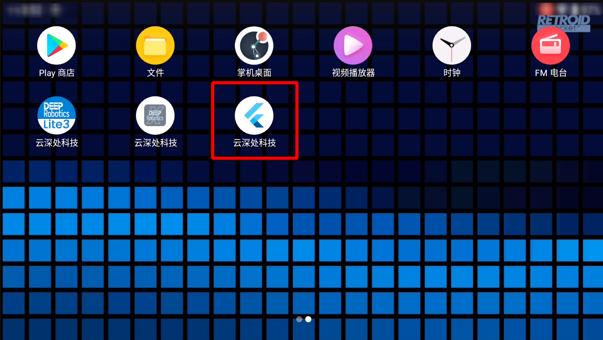
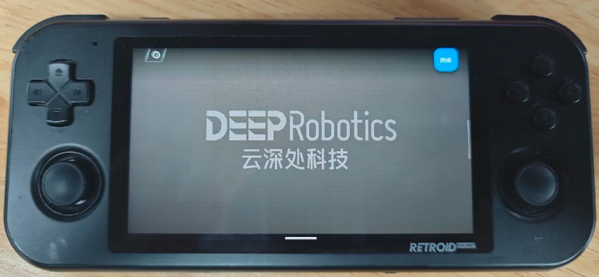
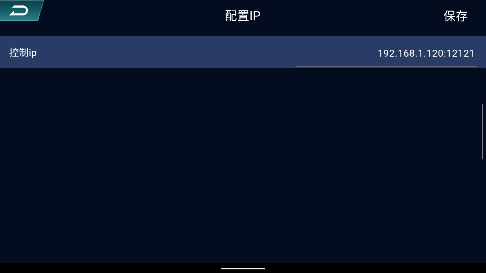
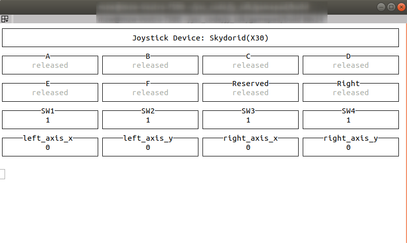
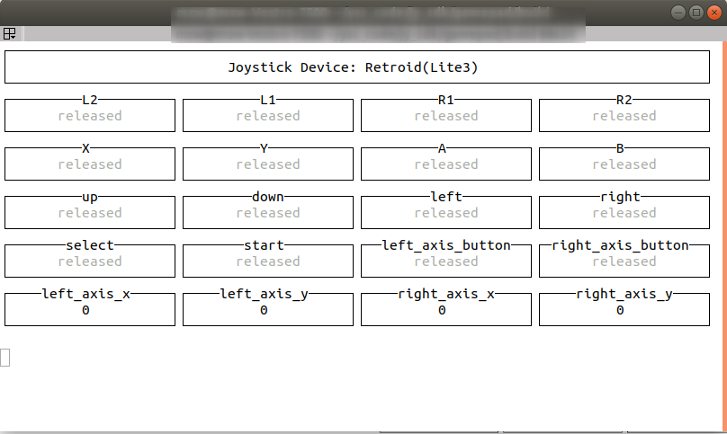

# gamepad Instructions

[简体中文](./README.md)

This project enables listening for physical button trigger events on the gamepad via UDP communication on the remote host. Developers can use this project to obtain real-time triggering information of physical buttons on the controller and develop your own robot remote control programs based on this information.

This repository vendors the directory as a third-party Retroid/Skydroid UDP gamepad parser. Mini Cheetah deployment guidance lives in the root project documentation.

## 1 Code Download and Compilation
Clone the code repository onto the development PC and compile it:
```bash
git clone --recurse-submodules https://github.com/DeepRoboticsLab/gamepad.git
mkdir build && cd build
cmake .. -DBUILD_EXAMPLE=ON
make -j4
```
**[Caution]** The program listens for controller data on port 12121 by default. Please ensure that the port is not being used by other programs. If needed, you can modify the port number by opening the corresponding file in the `/example` directory:
- For the Retroid controller, modify example_retroid.cpp
- For the Skydroid controller, modify example_skydroid.cpp

```c++
//Using example_retroid.cpp as an example
int main(int argc, char* argv[]) {
  RetroidGamepad rc(12121); 
  //RetroidGamepad rc( Port number for receiving handlebar commands )
  InitialRetroidKeys(rc);
  ......
}
```
After modifying the port number in the respective file, you can proceed with compiling the program.

&nbsp;
## 2 Program Execution
- Supported controllers usually come with the `controlapp.apk` pre-installed. After installation, the interface is shown in the figure below:

   

- Connect the controller to the development PC's network, then open the app. Click the button in the top-left corner to configure the IP address of the development PC that needs to be connected and the port number for the program to receive controller data. The image below uses the Retroid controller as an example.
   <p align="center"></p>
   <p align="center">App display interface</p>

   <p align="center">  </p>

   <p align="center">IP configuration interface</p>

- Run the Program:
   - Retroid controller:
      ```bash
      cd build/
      ./example/example_retroid
      ```
   - Skydroid controller:
      ```bash
      cd build/
      ./example/example_skydroid
      ```
- Press the physical buttons on the controller, and the terminal will display the trigger information of the controller's physical buttons:

   <p align="center"></p>

   <p align="center">Skydroid controller communication successful display interface</p>

   <p align="center"></p>

   <p align="center">Retroid controller communication successful display interface</p>


